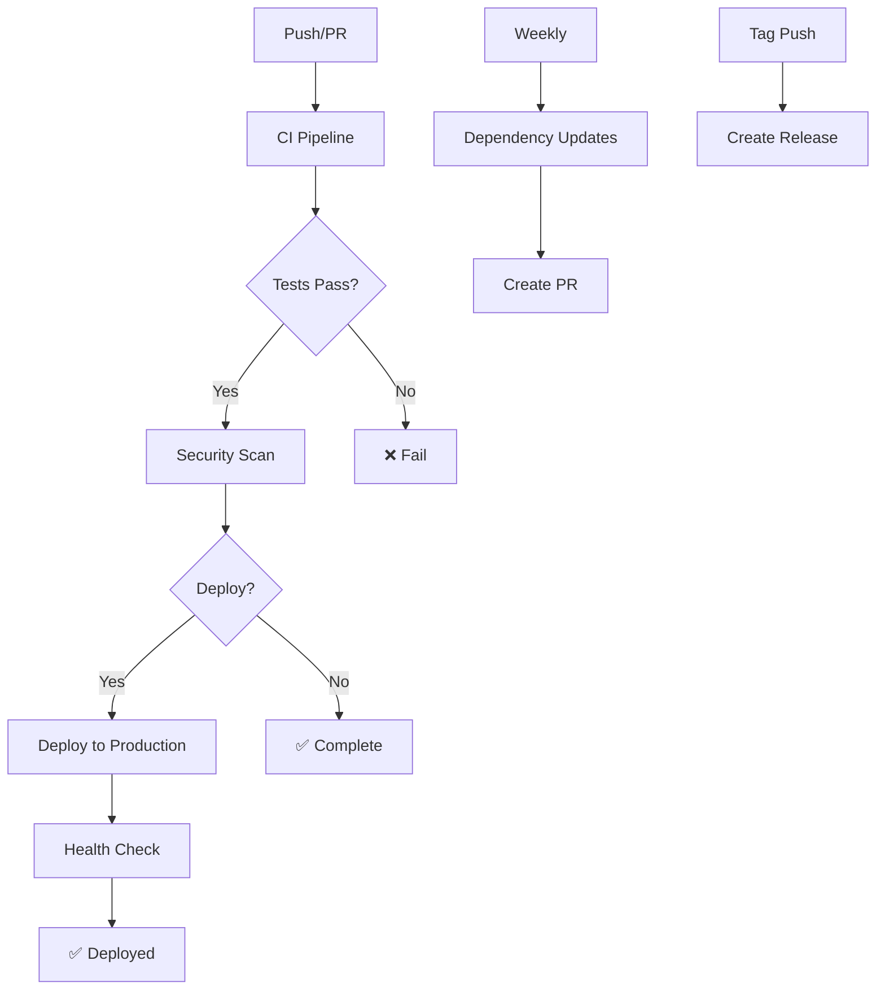

# GitHub Actions Workflows

This directory contains automated workflows for the Fundi API project.

## Workflows Overview

### 1. CI/CD Pipeline (`ci.yml`)
**Triggers:** Push to main/develop branches, Pull Requests
**Purpose:** Continuous Integration and testing

**Features:**
- ✅ Multi-PHP version testing (8.2, 8.3)
- ✅ MySQL database testing
- ✅ PHPUnit test execution with coverage
- ✅ Code quality checks (Laravel Pint, PHPStan)
- ✅ Security vulnerability scanning
- ✅ Asset building and caching
- ✅ Code coverage reporting to Codecov

### 2. Deployment (`deploy.yml`)
**Triggers:** Push to main branch, Manual dispatch
**Purpose:** Automated production deployment

**Features:**
- ✅ Multi-environment support (production/staging)
- ✅ Automated backup creation
- ✅ Zero-downtime deployment
- ✅ Database migration handling
- ✅ Asset optimization and caching
- ✅ Health checks post-deployment
- ✅ Rollback capability

### 3. Security Scanning (`security.yml`)
**Triggers:** Push/PR to main/develop, Daily schedule, Manual dispatch
**Purpose:** Comprehensive security analysis

**Features:**
- ✅ Enlightn security checker
- ✅ PHPStan security rules
- ✅ Trivy vulnerability scanning
- ✅ CodeQL analysis
- ✅ Secrets detection
- ✅ Laravel-specific security checks
- ✅ SARIF report generation

### 4. Dependency Updates (`dependencies.yml`)
**Triggers:** Weekly schedule (Mondays), Manual dispatch
**Purpose:** Automated dependency management

**Features:**
- ✅ Composer dependency updates
- ✅ NPM dependency updates
- ✅ Automated PR creation
- ✅ Test execution after updates
- ✅ Dependency report generation

### 5. Release Management (`release.yml`)
**Triggers:** Git tags, Manual dispatch
**Purpose:** Automated release creation

**Features:**
- ✅ Automatic changelog generation
- ✅ Release archive creation
- ✅ GitHub release publishing
- ✅ Asset upload and management

## Required Secrets

To use these workflows, you need to configure the following secrets in your GitHub repository:

### For Deployment (`deploy.yml`)
- `HOST`: Your server's IP address or hostname
- `USERNAME`: SSH username for deployment
- `SSH_KEY`: Private SSH key for server access
- `PORT`: SSH port (optional, defaults to 22)

### For Code Coverage (`ci.yml`)
- `CODECOV_TOKEN`: Codecov token for coverage reporting (optional)

## Environment Variables

The workflows use the following environment variables:

- `APP_ENV`: Set to `production` for deployment
- `PHP_VERSION`: Set to `8.2` for consistency
- `NODE_VERSION`: Set to `20` for Node.js

## Workflow Dependencies

## Best Practices

1. **Always test locally** before pushing to trigger CI
2. **Review security reports** regularly
3. **Monitor deployment health** after each release
4. **Keep dependencies updated** through automated PRs
5. **Use semantic versioning** for releases
6. **Configure proper secrets** for deployment

## Troubleshooting

### Common Issues

1. **Deployment fails**: Check SSH keys and server connectivity
2. **Tests fail**: Review test logs and fix failing tests
3. **Security scan alerts**: Address security vulnerabilities
4. **Dependency conflicts**: Review and resolve version conflicts

### Getting Help

- Check workflow logs in the Actions tab
- Review security reports in the Security tab
- Monitor deployment status in the Actions tab
- Check server logs for deployment issues

## Customization

You can customize these workflows by:

1. Modifying trigger conditions
2. Adding additional test environments
3. Configuring different deployment targets
4. Adding custom security checks
5. Adjusting dependency update schedules

## Security Considerations

- All secrets are encrypted and only accessible to authorized workflows
- SSH keys should have minimal required permissions
- Regular security scanning helps identify vulnerabilities
- Dependencies are automatically updated with security patches
